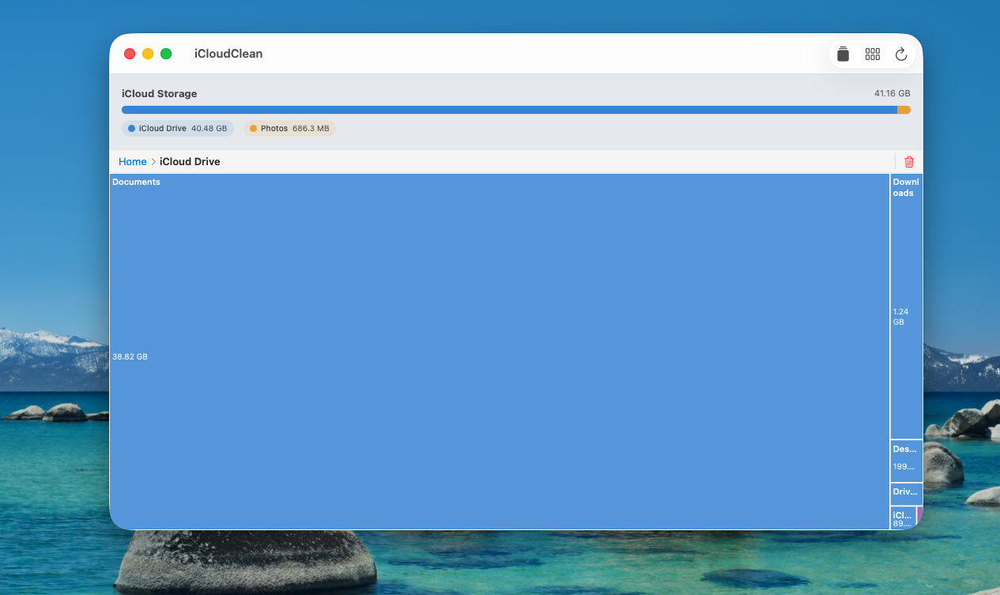

# iCloudClean

A native macOS app for visualizing and cleaning up iCloud Drive storage using an interactive treemap.

   

## Features

- **Treemap visualization** — see your iCloud Drive storage as a proportional map; bigger tile = more space used
- **Drill down** — double-click any folder to explore its contents
- **Delete files and folders** — removes from iCloud (not just locally); works on cloud-only content too
- **Download queue** — batch-download cloud-only files before deleting
- **Delete queue** — stage multiple items and delete all at once
- **iCloud Photos summary** — see how much space your photo library uses
- **App container scanning** — surfaces storage used by Notes, Mail, WhatsApp, GarageBand, and other iCloud-enabled apps
- **Hover info** — mouse over any tile to see the file name and size in the breadcrumb bar
- **Proportional / boosted icon modes** — toggle between true proportional sizes and a minimum-size mode that keeps small files clickable
- **Full Disk Access prompt** — guided setup if the app needs broader filesystem access

## Screenshots



## Requirements

- macOS 14 Sonoma or later
- Xcode 15+
- [XcodeGen](https://github.com/yonaskolb/XcodeGen) (`brew install xcodegen`)

## Building

```bash
git clone https://github.com/SethTenenbaum/iCloudClean.git
cd iCloudClean
xcodegen generate
open iCloudClean.xcodeproj
```

Then build and run in Xcode (⌘R).

> **Full Disk Access** — for the best results, grant Full Disk Access in System Settings → Privacy & Security → Full Disk Access. Without it the app can only see locally cached files.

## Known Limitations

**Cloud-only file sizes are approximate.** Files that haven't been downloaded to your Mac exist as small `.icloud` stub placeholders. Without iCloud container entitlements (which require a paid Apple Developer account), there's no public API to query Apple's servers for the real sizes of these stubs. The app shows stub sizes (a few KB each) rather than actual cloud sizes.

This means the total shown in the app will be lower than what Apple's Settings → iCloud shows — the gap is your cloud-only content. Deletion still works correctly regardless of displayed size.

**iCloud storage total may lag after deletions.** Apple's backend can take up to a few days to reflect deleted files in the reported quota. This is a server-side limitation, not an app bug.

## Contributing

Pull requests welcome. The most impactful open issue:

- **Accurate cloud-only file sizes** — if you have an Apple Developer account, adding iCloud container entitlements would enable `NSMetadataQuery` with ubiquitous scopes, giving real sizes for cloud-only content. See `iCloudDriveScanner.swift`.

Other areas:
- App icon
- iOS support (the project targets both platforms but UI is tuned for macOS)
- Better size accuracy for third-party app containers

## License

MIT
